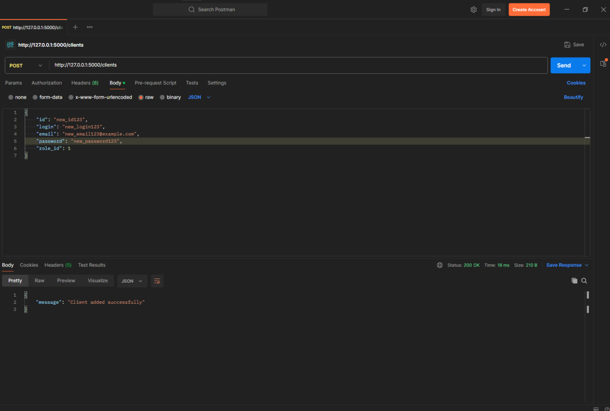

# Тестування працездатності системи

## Метод GET:

  

## Метод POST:

  

### Метод GET для перевірки:

  

## Метод PUT:

  

### Метод GET для перевірки:

  

## Метод DELETE:

  

### Метод GET для перевірки:

  

